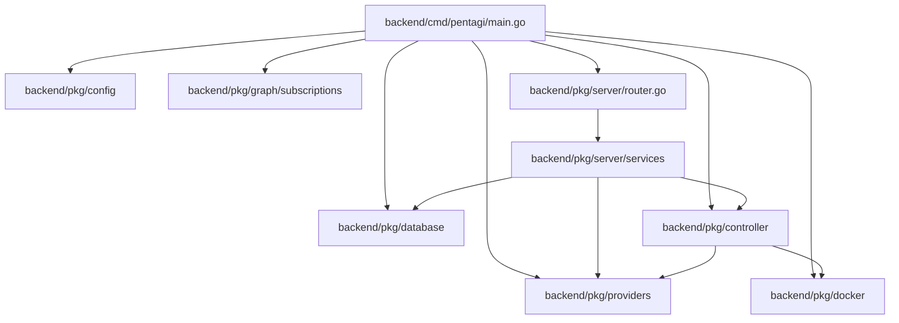
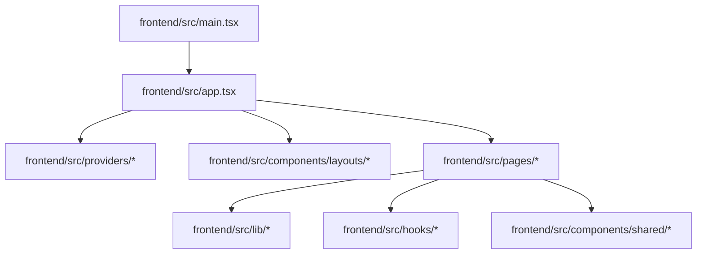

# 文件与模块关系图谱

## 关系口径

- Go：以 `import` 产生的包级依赖为主，因此更适合读成“文件所属包 -> 目标包”的关系。
- TypeScript/TSX：以具体模块导入为主，因此同时保留“文件 -> 文件”和“目录 -> 目录”的关系。
- 非代码配置文件仅在文件索引中给出职责说明，不强行构造虚假的调用链。

## 后端主启动链

## 前端主渲染链

## 后端包级高频依赖

| 源目录 | 目标目录 | 直接 import 次数 |
|---|---|---:|
| `backend/pkg/tools` | `backend/pkg/database` | 30 |
| `backend/pkg/observability/langfuse/api` | `backend/pkg/observability/langfuse/api/internal` | 28 |
| `backend/pkg/server/services` | `backend/pkg/server/models` | 28 |
| `backend/cmd/installer/wizard/models` | `backend/cmd/installer/wizard/styles` | 26 |
| `backend/cmd/installer/wizard/models` | `backend/cmd/installer/wizard/window` | 26 |
| `backend/pkg/server/services` | `backend/pkg/server/logger` | 26 |
| `backend/cmd/installer/wizard/models` | `backend/cmd/installer/wizard/controller` | 25 |
| `backend/pkg/controller` | `backend/pkg/database` | 25 |
| `backend/pkg/server/services` | `backend/pkg/server/response` | 25 |
| `backend/cmd/installer/wizard/models` | `backend/cmd/installer/wizard/locale` | 24 |
| `backend/pkg/controller` | `backend/pkg/graph/subscriptions` | 20 |
| `backend/pkg/observability/langfuse` | `backend/pkg/observability/langfuse/api` | 18 |
| `backend/pkg/server/services` | `backend/pkg/server/rdb` | 18 |
| `backend/pkg/tools` | `backend/pkg/observability` | 15 |
| `backend/pkg/tools` | `backend/pkg/config` | 15 |
| `backend/pkg/tools` | `backend/pkg/observability/langfuse` | 14 |
| `backend/cmd/installer/wizard/models` | `backend/cmd/installer/wizard/logger` | 13 |
| `backend/cmd/installer/wizard/models` | `backend/cmd/installer/loader` | 10 |
| `backend/pkg/providers` | `backend/pkg/database` | 9 |
| `backend/pkg/providers` | `backend/pkg/tools` | 9 |
| `backend/pkg/server/auth` | `backend/pkg/server/models` | 9 |
| `backend/pkg/server/auth` | `backend/pkg/server/auth` | 8 |
| `backend/pkg/server/services` | `backend/pkg/graph/subscriptions` | 8 |
| `backend/cmd/installer/processor` | `backend/cmd/installer/files` | 7 |
| `backend/pkg/controller` | `backend/pkg/providers` | 7 |
| `backend/pkg/providers` | `backend/pkg/cast` | 7 |
| `backend/pkg/providers` | `backend/pkg/observability` | 7 |
| `backend/pkg/providers` | `backend/pkg/providers/pconfig` | 7 |
| `backend/pkg/providers` | `backend/pkg/templates` | 7 |
| `backend/pkg/tools` | `backend/pkg/system` | 7 |
| `backend/cmd/etester` | `backend/pkg/terminal` | 6 |
| `backend/cmd/installer/processor` | `backend/cmd/installer/checker` | 6 |
| `backend/pkg/providers` | `backend/pkg/csum` | 6 |
| `backend/pkg/server/services` | `backend/pkg/server/auth` | 6 |
| `backend/pkg/controller` | `backend/pkg/tools` | 5 |
| `backend/pkg/observability/langfuse/api/internal` | `backend/pkg/observability/langfuse/api/core` | 5 |
| `backend/pkg/providers` | `backend/pkg/docker` | 5 |
| `backend/pkg/providers` | `backend/pkg/observability/langfuse` | 5 |
| `backend/pkg/providers/provider` | `backend/pkg/providers/pconfig` | 5 |
| `backend/pkg/server/services` | `backend/pkg/database` | 5 |

## 前端目录级高频依赖

| 源目录 | 目标目录 | 直接 import 次数 |
|---|---|---:|
| `frontend/src/components/shared/file-manager` | `frontend/src/components/shared/file-manager` | 46 |
| `frontend/src/pages/settings` | `frontend/src/components/ui` | 45 |
| `frontend/src/components/ui` | `frontend/src/lib` | 44 |
| `frontend/src/components/ui` | `frontend/src/components/ui` | 34 |
| `frontend/src/features/flows/files` | `frontend/src/features/flows/files` | 34 |
| `frontend/src/pages/flows` | `frontend/src/components/ui` | 24 |
| `frontend/src/pages/templates` | `frontend/src/components/ui` | 22 |
| `frontend/src/features/flows/files` | `frontend/src/components/ui` | 19 |
| `frontend/src/components/shared/detail-navigation` | `frontend/src/components/shared/detail-navigation` | 18 |
| `frontend/src/features/knowledges` | `frontend/src/components/ui` | 17 |
| `frontend/src/components/icons` | `frontend/src/lib` | 15 |
| `frontend/src/features/resources` | `frontend/src/features/resources` | 15 |
| `frontend/src/features/flows` | `frontend/src/components/ui` | 14 |
| `frontend/src/features/resources` | `frontend/src/components/ui` | 13 |
| `frontend/src/features/flows/messages` | `frontend/src/components/ui` | 12 |
| `frontend/src/components/icons` | `frontend/src/components/icons` | 11 |
| `frontend/src/components/shared/file-manager` | `frontend/src/components/ui` | 11 |
| `frontend/src/pages/knowledges` | `frontend/src/components/ui` | 11 |
| `frontend/src` | `frontend/src/providers` | 10 |
| `frontend/src/features/flows/files` | `frontend/src/components/shared/file-manager` | 10 |
| `frontend/src/lib` | `frontend/src/lib` | 10 |
| `frontend/src/pages/dashboard` | `frontend/src/components/ui` | 10 |
| `frontend/src/pages/settings` | `frontend/src/components/icons` | 10 |
| `frontend/src/providers` | `frontend/src/graphql` | 9 |
| `frontend/src/components/shared/terminal` | `frontend/src/components/shared/terminal` | 8 |
| `frontend/src/features/authentication` | `frontend/src/components/ui` | 8 |
| `frontend/src/features/flows/tasks` | `frontend/src/components/ui` | 8 |
| `frontend/src/pages/flows` | `frontend/src/providers` | 8 |
| `frontend/src/pages/resources` | `frontend/src/components/ui` | 8 |
| `frontend/src/pages/resources` | `frontend/src/features/resources` | 8 |
| `frontend/src/providers` | `frontend/src/lib` | 8 |
| `frontend/src/components/layouts` | `frontend/src/components/ui` | 7 |
| `frontend/src/components/shared/detail-navigation` | `frontend/src/components/ui` | 7 |
| `frontend/src/features/flows/files` | `frontend/src/components/shared/overwrite` | 7 |
| `frontend/src/features/flows/files` | `frontend/src/features/resources` | 7 |
| `frontend/src/features/flows/files` | `frontend/src/lib` | 7 |
| `frontend/src/features/knowledges` | `frontend/src/features/knowledges` | 7 |
| `frontend/src/components/shared/file-manager` | `frontend/src/lib` | 6 |
| `frontend/src/components/ui` | `frontend/src/hooks` | 6 |
| `frontend/src/features/flows/agents` | `frontend/src/components/ui` | 6 |

## 最常被直接引用的文件

| 文件 | 入边数量 | 典型角色 |
|---|---:|---|
| `frontend/src/lib/utils.ts` | 90 | 前端基础设施文件，负责 Apollo、HTTP、路由标题或报表等通用支撑。 |
| `frontend/src/graphql/types.ts` | 59 | GraphQL 文档或生成类型文件，连接前端与后端 Schema。 |
| `frontend/src/components/ui/button.tsx` | 45 | 可复用 UI 基础组件文件，服务于多页面共享的展示和交互能力。 |
| `frontend/src/components/ui/tooltip.tsx` | 26 | 可复用 UI 基础组件文件，服务于多页面共享的展示和交互能力。 |
| `frontend/src/components/ui/form.tsx` | 21 | 可复用 UI 基础组件文件，服务于多页面共享的展示和交互能力。 |
| `frontend/src/components/ui/input-group.tsx` | 18 | 可复用 UI 基础组件文件，服务于多页面共享的展示和交互能力。 |
| `frontend/src/lib/utils/format.ts` | 18 | 前端基础设施文件，负责 Apollo、HTTP、路由标题或报表等通用支撑。 |
| `frontend/src/components/shared/confirmation-dialog.tsx` | 17 | 跨页面共享的前端业务组件文件。 |
| `frontend/src/lib/log.ts` | 16 | 前端基础设施文件，负责 Apollo、HTTP、路由标题或报表等通用支撑。 |
| `frontend/src/components/shared/file-manager/file-manager-types.ts` | 15 | 跨页面共享的前端业务组件文件。 |
| `frontend/src/components/shared/file-manager/index.ts` | 15 | 跨页面共享的前端业务组件文件。 |
| `frontend/src/components/ui/dropdown-menu.tsx` | 15 | 可复用 UI 基础组件文件，服务于多页面共享的展示和交互能力。 |
| `frontend/src/components/ui/badge.tsx` | 14 | 可复用 UI 基础组件文件，服务于多页面共享的展示和交互能力。 |
| `frontend/src/lib/axios.ts` | 14 | 前端基础设施文件，负责 Apollo、HTTP、路由标题或报表等通用支撑。 |
| `frontend/src/providers/flow-provider.tsx` | 14 | React Context Provider 文件，向子树分发全局状态或远程数据。 |
| `frontend/src/providers/user-provider.tsx` | 14 | React Context Provider 文件，向子树分发全局状态或远程数据。 |
| `frontend/src/components/ui/dialog.tsx` | 13 | 可复用 UI 基础组件文件，服务于多页面共享的展示和交互能力。 |
| `frontend/src/components/ui/empty.tsx` | 13 | 可复用 UI 基础组件文件，服务于多页面共享的展示和交互能力。 |
| `frontend/src/components/shared/overwrite/index.ts` | 12 | 跨页面共享的前端业务组件文件。 |
| `frontend/src/components/ui/input.tsx` | 12 | 可复用 UI 基础组件文件，服务于多页面共享的展示和交互能力。 |
| `frontend/src/components/ui/separator.tsx` | 12 | 可复用 UI 基础组件文件，服务于多页面共享的展示和交互能力。 |
| `frontend/src/components/ui/sidebar.tsx` | 12 | 可复用 UI 基础组件文件，服务于多页面共享的展示和交互能力。 |
| `frontend/src/components/shared/file-manager/file-manager-utils.ts` | 11 | 跨页面共享的前端业务组件文件。 |
| `frontend/src/components/ui/card.tsx` | 11 | 可复用 UI 基础组件文件，服务于多页面共享的展示和交互能力。 |
| `frontend/src/features/flows/files/flow-files-constants.ts` | 11 | 按业务场景组织的前端功能模块文件。 |

## 前端文件到文件示例关系

以下仅展示前 120 条解析到的前端具体文件引用，完整图请查阅 `relationships.json`。

| 源文件 | 目标文件 |
|---|---|
| `frontend/src/app.tsx` | `frontend/src/components/layouts/app-layout.tsx` |
| `frontend/src/app.tsx` | `frontend/src/components/layouts/flows-layout.tsx` |
| `frontend/src/app.tsx` | `frontend/src/components/layouts/main-layout.tsx` |
| `frontend/src/app.tsx` | `frontend/src/components/layouts/settings-layout.tsx` |
| `frontend/src/app.tsx` | `frontend/src/components/routes/protected-route.tsx` |
| `frontend/src/app.tsx` | `frontend/src/components/routes/public-route.tsx` |
| `frontend/src/app.tsx` | `frontend/src/components/shared/document-title.tsx` |
| `frontend/src/app.tsx` | `frontend/src/components/shared/page-loader.tsx` |
| `frontend/src/app.tsx` | `frontend/src/components/ui/sonner.tsx` |
| `frontend/src/app.tsx` | `frontend/src/lib/apollo.ts` |
| `frontend/src/app.tsx` | `frontend/src/lib/route-titles/index.ts` |
| `frontend/src/app.tsx` | `frontend/src/providers/favorites-provider.tsx` |
| `frontend/src/app.tsx` | `frontend/src/providers/flow-provider.tsx` |
| `frontend/src/app.tsx` | `frontend/src/providers/knowledges-provider.tsx` |
| `frontend/src/app.tsx` | `frontend/src/providers/providers-provider.tsx` |
| `frontend/src/app.tsx` | `frontend/src/providers/resources-provider.tsx` |
| `frontend/src/app.tsx` | `frontend/src/providers/sidebar-flows-provider.tsx` |
| `frontend/src/app.tsx` | `frontend/src/providers/templates-provider.tsx` |
| `frontend/src/app.tsx` | `frontend/src/providers/theme-provider.tsx` |
| `frontend/src/app.tsx` | `frontend/src/providers/user-provider.tsx` |
| `frontend/src/app.tsx` | `frontend/src/providers/system-settings-provider.tsx` |
| `frontend/src/app.tsx` | `frontend/src/pages/dashboard/dashboard.tsx` |
| `frontend/src/app.tsx` | `frontend/src/pages/flows/flow.tsx` |
| `frontend/src/app.tsx` | `frontend/src/pages/flows/flow-report.tsx` |
| `frontend/src/app.tsx` | `frontend/src/pages/flows/flows.tsx` |
| `frontend/src/app.tsx` | `frontend/src/pages/flows/new-flow.tsx` |
| `frontend/src/app.tsx` | `frontend/src/pages/login.tsx` |
| `frontend/src/app.tsx` | `frontend/src/pages/knowledges/knowledge.tsx` |
| `frontend/src/app.tsx` | `frontend/src/pages/knowledges/knowledges.tsx` |
| `frontend/src/app.tsx` | `frontend/src/pages/resources/resources.tsx` |
| `frontend/src/app.tsx` | `frontend/src/pages/templates/template.tsx` |
| `frontend/src/app.tsx` | `frontend/src/pages/templates/templates.tsx` |
| `frontend/src/app.tsx` | `frontend/src/pages/oauth-result.tsx` |
| `frontend/src/app.tsx` | `frontend/src/pages/settings/settings-api-tokens.tsx` |
| `frontend/src/app.tsx` | `frontend/src/pages/settings/settings-prompt.tsx` |
| `frontend/src/app.tsx` | `frontend/src/pages/settings/settings-prompts.tsx` |
| `frontend/src/app.tsx` | `frontend/src/pages/settings/settings-provider.tsx` |
| `frontend/src/app.tsx` | `frontend/src/pages/settings/settings-providers.tsx` |
| `frontend/src/components/dashboard/chart-card.tsx` | `frontend/src/components/ui/card.tsx` |
| `frontend/src/components/dashboard/chart-tooltip.tsx` | `frontend/src/lib/utils/format.ts` |
| `frontend/src/components/dashboard/index.ts` | `frontend/src/components/dashboard/chart-card.tsx` |
| `frontend/src/components/dashboard/index.ts` | `frontend/src/components/dashboard/chart-tooltip.tsx` |
| `frontend/src/components/dashboard/index.ts` | `frontend/src/components/dashboard/metric-card.tsx` |
| `frontend/src/components/dashboard/metric-card.tsx` | `frontend/src/components/ui/card.tsx` |
| `frontend/src/components/dashboard/metric-card.tsx` | `frontend/src/components/ui/skeleton.tsx` |
| `frontend/src/components/icons/anthropic.tsx` | `frontend/src/lib/utils.ts` |
| `frontend/src/components/icons/bedrock.tsx` | `frontend/src/lib/utils.ts` |
| `frontend/src/components/icons/custom.tsx` | `frontend/src/lib/utils.ts` |
| `frontend/src/components/icons/deepseek.tsx` | `frontend/src/lib/utils.ts` |
| `frontend/src/components/icons/flow-status-badge.tsx` | `frontend/src/components/icons/flow-status-icon.tsx` |
| `frontend/src/components/icons/flow-status-badge.tsx` | `frontend/src/components/ui/badge.tsx` |
| `frontend/src/components/icons/flow-status-badge.tsx` | `frontend/src/graphql/types.ts` |
| `frontend/src/components/icons/flow-status-icon.tsx` | `frontend/src/components/ui/tooltip.tsx` |
| `frontend/src/components/icons/flow-status-icon.tsx` | `frontend/src/graphql/types.ts` |
| `frontend/src/components/icons/flow-status-icon.tsx` | `frontend/src/lib/utils.ts` |
| `frontend/src/components/icons/gemini.tsx` | `frontend/src/lib/utils.ts` |
| `frontend/src/components/icons/github.tsx` | `frontend/src/lib/utils.ts` |
| `frontend/src/components/icons/glm.tsx` | `frontend/src/lib/utils.ts` |
| `frontend/src/components/icons/google.tsx` | `frontend/src/lib/utils.ts` |
| `frontend/src/components/icons/kimi.tsx` | `frontend/src/lib/utils.ts` |
| `frontend/src/components/icons/logo.tsx` | `frontend/src/lib/utils.ts` |
| `frontend/src/components/icons/ollama.tsx` | `frontend/src/lib/utils.ts` |
| `frontend/src/components/icons/open-ai.tsx` | `frontend/src/lib/utils.ts` |
| `frontend/src/components/icons/provider-icon.tsx` | `frontend/src/models/provider.tsx` |
| `frontend/src/components/icons/provider-icon.tsx` | `frontend/src/components/ui/tooltip.tsx` |
| `frontend/src/components/icons/provider-icon.tsx` | `frontend/src/graphql/types.ts` |
| `frontend/src/components/icons/provider-icon.tsx` | `frontend/src/lib/utils.ts` |
| `frontend/src/components/icons/provider-icon.tsx` | `frontend/src/components/icons/anthropic.tsx` |
| `frontend/src/components/icons/provider-icon.tsx` | `frontend/src/components/icons/bedrock.tsx` |
| `frontend/src/components/icons/provider-icon.tsx` | `frontend/src/components/icons/custom.tsx` |
| `frontend/src/components/icons/provider-icon.tsx` | `frontend/src/components/icons/deepseek.tsx` |
| `frontend/src/components/icons/provider-icon.tsx` | `frontend/src/components/icons/gemini.tsx` |
| `frontend/src/components/icons/provider-icon.tsx` | `frontend/src/components/icons/glm.tsx` |
| `frontend/src/components/icons/provider-icon.tsx` | `frontend/src/components/icons/kimi.tsx` |
| `frontend/src/components/icons/provider-icon.tsx` | `frontend/src/components/icons/ollama.tsx` |
| `frontend/src/components/icons/provider-icon.tsx` | `frontend/src/components/icons/open-ai.tsx` |
| `frontend/src/components/icons/provider-icon.tsx` | `frontend/src/components/icons/qwen.tsx` |
| `frontend/src/components/icons/qwen.tsx` | `frontend/src/lib/utils.ts` |
| `frontend/src/components/layouts/flows-layout.tsx` | `frontend/src/providers/flows-provider.tsx` |
| `frontend/src/components/layouts/main-layout.tsx` | `frontend/src/components/layouts/main-sidebar.tsx` |
| `frontend/src/components/layouts/main-layout.tsx` | `frontend/src/components/ui/sidebar.tsx` |
| `frontend/src/components/layouts/main-sidebar.tsx` | `frontend/src/providers/sidebar-flows-provider.tsx` |
| `frontend/src/components/layouts/main-sidebar.tsx` | `frontend/src/providers/theme-provider.tsx` |
| `frontend/src/components/layouts/main-sidebar.tsx` | `frontend/src/components/icons/logo.tsx` |
| `frontend/src/components/layouts/main-sidebar.tsx` | `frontend/src/components/ui/dialog.tsx` |
| `frontend/src/components/layouts/main-sidebar.tsx` | `frontend/src/components/ui/dropdown-menu.tsx` |
| `frontend/src/components/layouts/main-sidebar.tsx` | `frontend/src/components/ui/sidebar.tsx` |
| `frontend/src/components/layouts/main-sidebar.tsx` | `frontend/src/components/ui/tabs.tsx` |
| `frontend/src/components/layouts/main-sidebar.tsx` | `frontend/src/features/authentication/password-change-form.tsx` |
| `frontend/src/components/layouts/main-sidebar.tsx` | `frontend/src/features/resources/use-resources-upload.ts` |
| `frontend/src/components/layouts/main-sidebar.tsx` | `frontend/src/hooks/use-theme.ts` |
| `frontend/src/components/layouts/main-sidebar.tsx` | `frontend/src/providers/favorites-provider.tsx` |
| `frontend/src/components/layouts/main-sidebar.tsx` | `frontend/src/providers/user-provider.tsx` |
| `frontend/src/components/layouts/settings-layout.tsx` | `frontend/src/components/ui/separator.tsx` |
| `frontend/src/components/layouts/settings-layout.tsx` | `frontend/src/components/ui/sidebar.tsx` |
| `frontend/src/components/routes/protected-route.tsx` | `frontend/src/lib/utils/auth.ts` |
| `frontend/src/components/routes/protected-route.tsx` | `frontend/src/providers/user-provider.tsx` |
| `frontend/src/components/routes/public-route.tsx` | `frontend/src/lib/utils/auth.ts` |
| `frontend/src/components/routes/public-route.tsx` | `frontend/src/providers/user-provider.tsx` |
| `frontend/src/components/shared/confirmation-dialog.tsx` | `frontend/src/components/ui/button.tsx` |
| `frontend/src/components/shared/confirmation-dialog.tsx` | `frontend/src/components/ui/dialog.tsx` |
| `frontend/src/components/shared/confirmation-dialog.tsx` | `frontend/src/lib/utils.ts` |
| `frontend/src/components/shared/detail-navigation/detail-navigation-buttons.tsx` | `frontend/src/components/ui/button.tsx` |
| `frontend/src/components/shared/detail-navigation/detail-navigation-buttons.tsx` | `frontend/src/components/ui/tooltip.tsx` |
| `frontend/src/components/shared/detail-navigation/detail-navigation-buttons.tsx` | `frontend/src/lib/utils.ts` |
| `frontend/src/components/shared/detail-navigation/detail-navigation-buttons.tsx` | `frontend/src/components/shared/detail-navigation/use-detail-navigation.ts` |
| `frontend/src/components/shared/detail-navigation/detail-navigation-sheet.test.tsx` | `frontend/src/components/ui/tooltip.tsx` |
| `frontend/src/components/shared/detail-navigation/detail-navigation-sheet.test.tsx` | `frontend/src/components/shared/detail-navigation/detail-navigation-sheet.tsx` |
| `frontend/src/components/shared/detail-navigation/detail-navigation-sheet.test.tsx` | `frontend/src/components/shared/detail-navigation/use-detail-navigation.ts` |
| `frontend/src/components/shared/detail-navigation/detail-navigation-sheet.tsx` | `frontend/src/components/ui/badge.tsx` |
| `frontend/src/components/shared/detail-navigation/detail-navigation-sheet.tsx` | `frontend/src/components/ui/input-group.tsx` |
| `frontend/src/components/shared/detail-navigation/detail-navigation-sheet.tsx` | `frontend/src/components/ui/sheet.tsx` |
| `frontend/src/components/shared/detail-navigation/detail-navigation-sheet.tsx` | `frontend/src/lib/utils.ts` |
| `frontend/src/components/shared/detail-navigation/detail-navigation-sheet.tsx` | `frontend/src/components/shared/detail-navigation/use-detail-navigation.ts` |
| `frontend/src/components/shared/detail-navigation/detail-navigation-toolbar.test.tsx` | `frontend/src/components/ui/tooltip.tsx` |
| `frontend/src/components/shared/detail-navigation/detail-navigation-toolbar.test.tsx` | `frontend/src/components/shared/detail-navigation/detail-navigation-toolbar.tsx` |
| `frontend/src/components/shared/detail-navigation/detail-navigation-toolbar.test.tsx` | `frontend/src/components/shared/detail-navigation/use-detail-navigation.ts` |
| `frontend/src/components/shared/detail-navigation/detail-navigation-toolbar.tsx` | `frontend/src/components/shared/detail-navigation/use-detail-navigation.ts` |
| `frontend/src/components/shared/detail-navigation/detail-navigation-toolbar.tsx` | `frontend/src/components/shared/detail-navigation/detail-navigation-buttons.tsx` |
| `frontend/src/components/shared/detail-navigation/detail-navigation-toolbar.tsx` | `frontend/src/components/shared/detail-navigation/detail-navigation-sheet.tsx` |